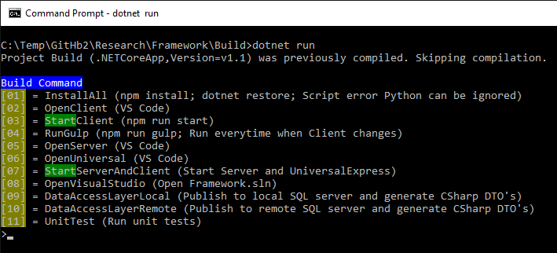
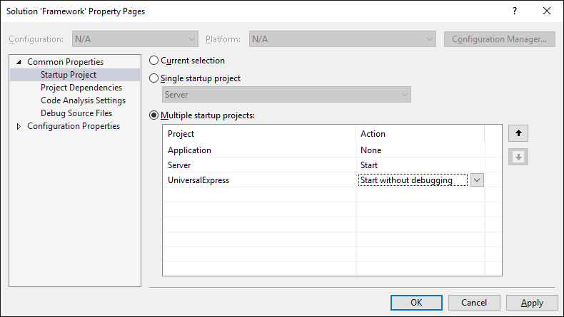
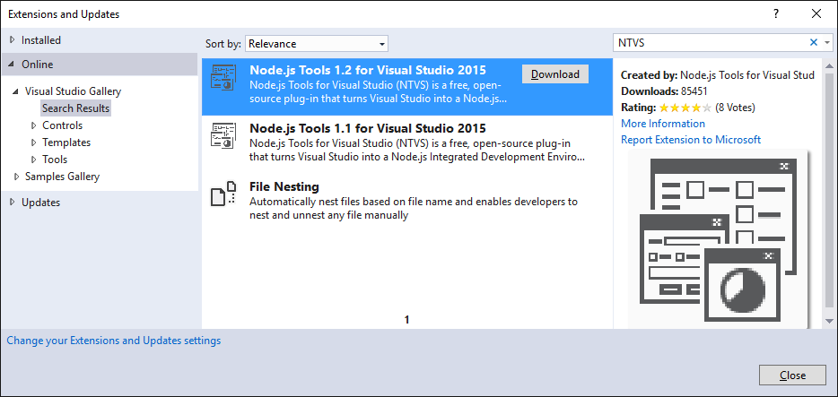

# Framework
Bundle to create applications based on Angular 2 with server side rendering, ASP.NET Core and SQL.

## Folder Structure
* **Build/** (Build and deploy scripts with command line interface CLI. Also used for CI)
* **Application/** (Contains .NET Core business logic)
* **Client/** (Angular 2 client)
* **Office/** (ETL to load (*.xlsx) files into database. It's ".NET". Not ".NET Core"!)
* **Server/** (ASP.NET Core server)
* **Universal/** (Angular 2 server side rendering)
* **UniversalExpress/** (Used for debug in Visual Studio only. Runs Universal in Express server)

## Install
* run /build.cmd
* 01=InstallAll
* 07=StartServerAndClient

## Build CLI
Command line interface containing all scripts and tools to build and deploy. Can also be used for CI.

## Visual Studio
* Open Framework.sln
* Configure multiple start up projects (Server, UniversalExpress)

## Server

## UniversalExpress
