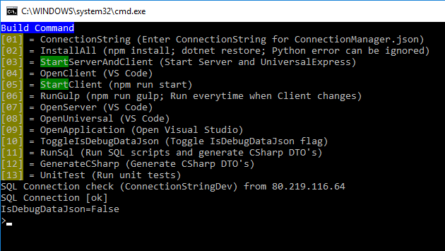
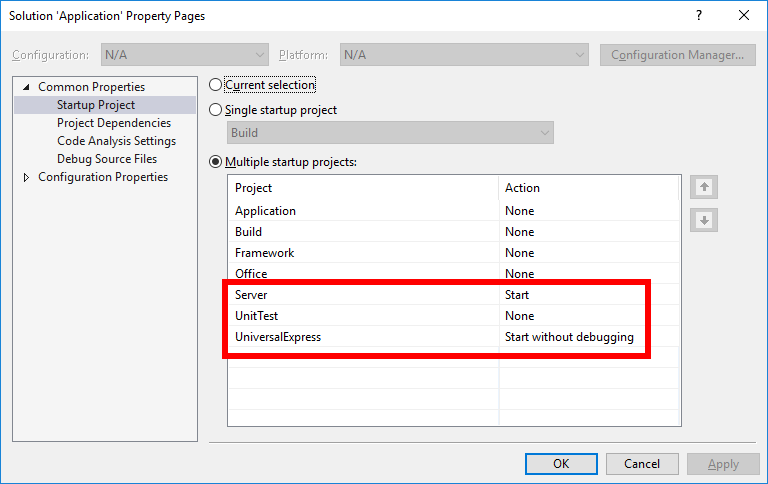

# Framework
Submodule to create applications based on Angular 2 with server side rendering, ASP.NET Core and SQL. Only to be used in connection with
* [ApplicationDemo](https://github.com/WorkplaceX/ApplicationDemo)

## Folder Structure
* **Application/** (Contains .NET Core business logic)
* **Build/** (Build and deploy scripts with command line interface CLI. Also used for CI)
* **Server/** (ASP.NET Core server)
* **Submodule/Client/** (Angular 2 client)
* **Submodule/Framework/** (Framework with generic functions)
* **Submodule/Office/** (ETL to load (*.xlsx) files into database. It's ".NET". Not ".NET Core"!)
* **Submodule/Universal/** (Angular 2 server side rendering)
* **Submodule/UniversalExpress/** (Used for debug in Visual Studio only. Runs Universal in Express server)

## Install
* run /build.cmd
* 01=InstallAll
* 07=StartServerAndClient

## Build CLI
Command line interface containing all scripts and tools to build and deploy. Can also be used for CI.

## Visual Studio 2017
* Prerequisite

* Open Application.sln
* Configure multiple start up projects (Server, UniversalExpress)

