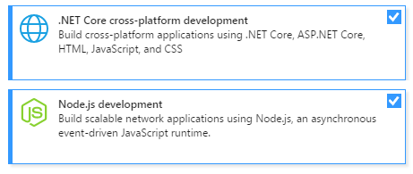
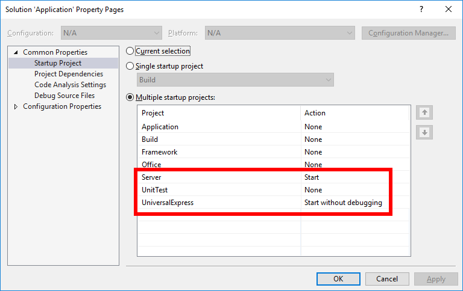

# Framework
Framework to create database applications based on Angular 4 with server side rendering, ASP.NET Core and MS-SQL. This repo contains no business logic. Business logic goes into your repo.

## Visual Studio 2017
* Install the following VS2017 components:

* Open Application.sln

* Configure multiple start up projects (Server, UniversalExpress)

